<p align="center">
  <a href="https://sakaai-simulator.vercel.app" target="_blank" rel="noopener noreferrer">
    
  </a>
</p>

[](https://sakaai-simulator.vercel.app)
[](https://fastapi.tiangolo.com/)


[](https://github.com/Programming-Sai/Sakaai-Simulator/stargazers)

# Sakaai Simulator

An AI-powered quiz generator & evaluator inspired by Sakai’s quiz workflow.

| Light Theme                                                        | Dark Theme                                                       |
| ------------------------------------------------------------------ | ---------------------------------------------------------------- |
| 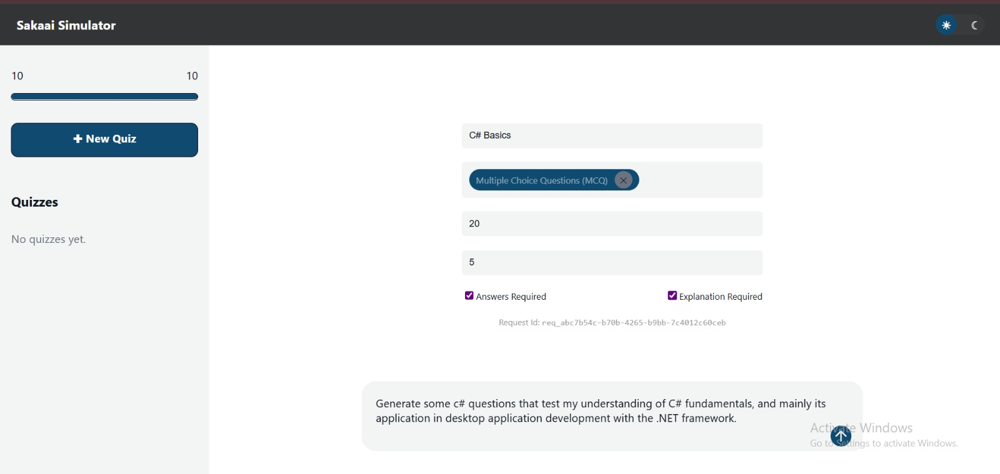                              | 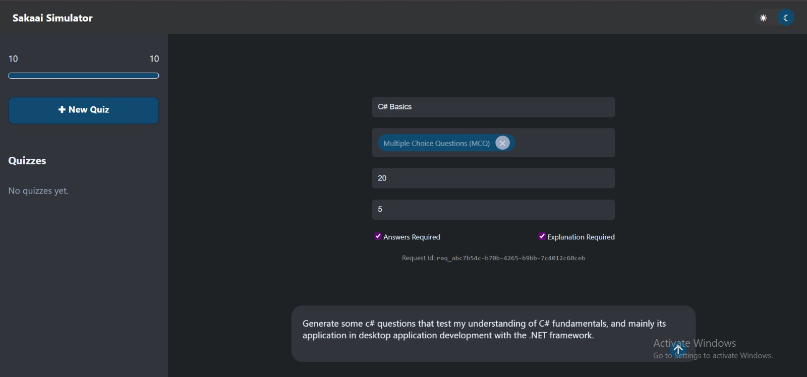                              |
| 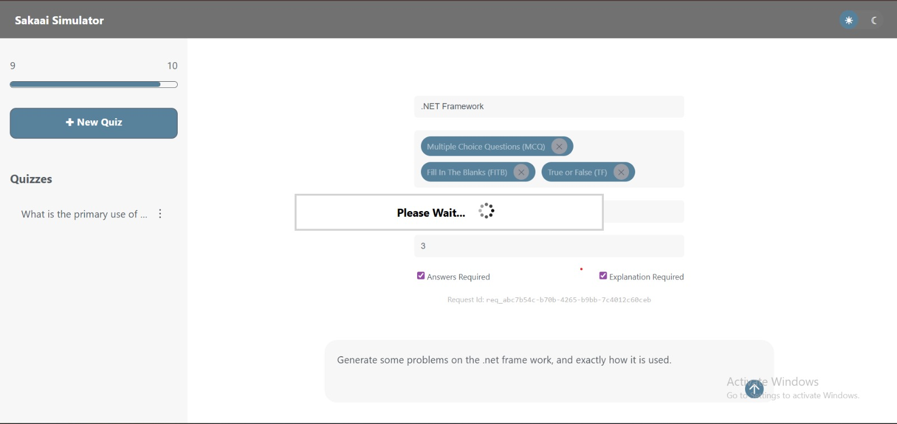                        | 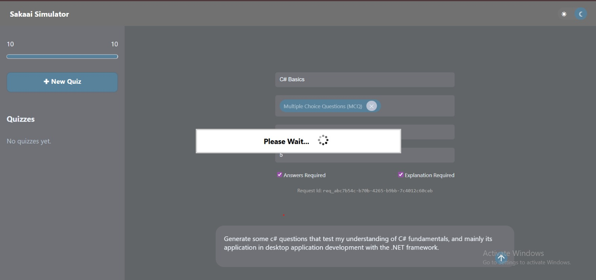                        |
| 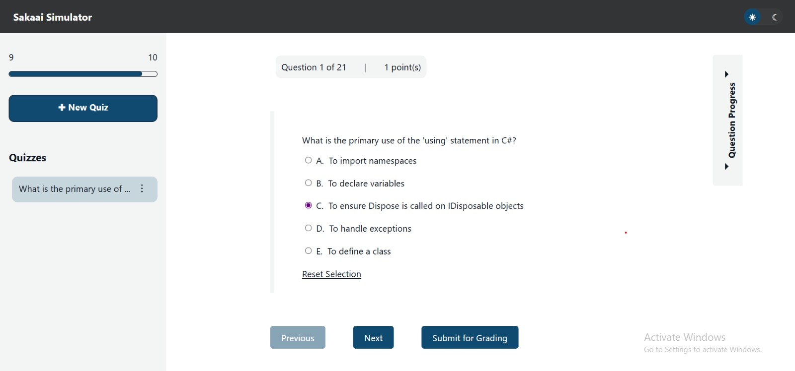                              | 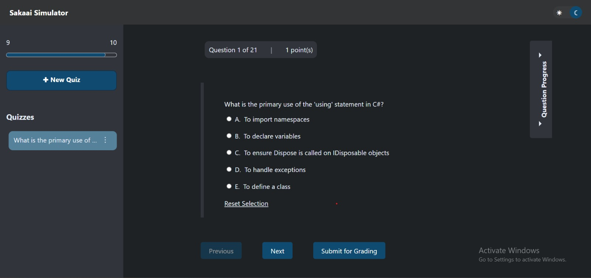                              |
| 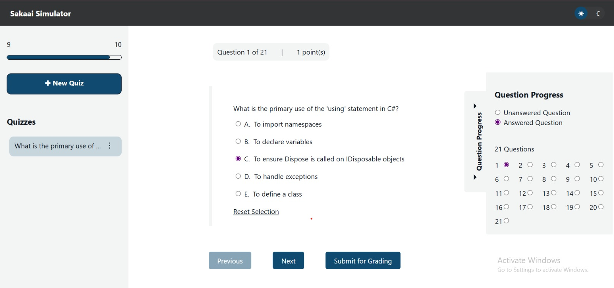     | 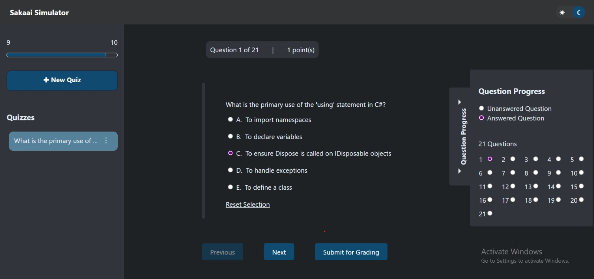     |
| 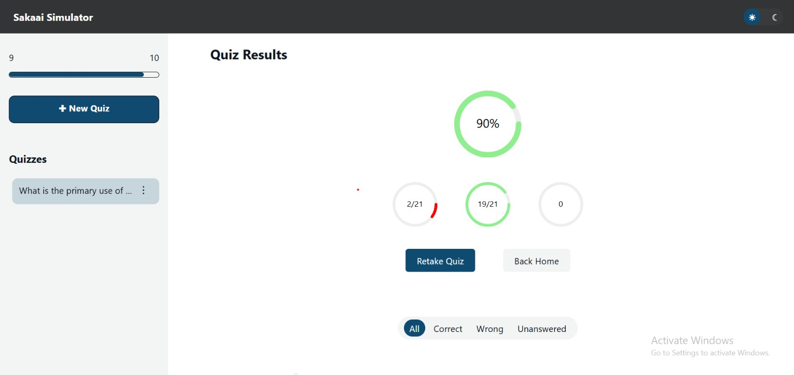                        | 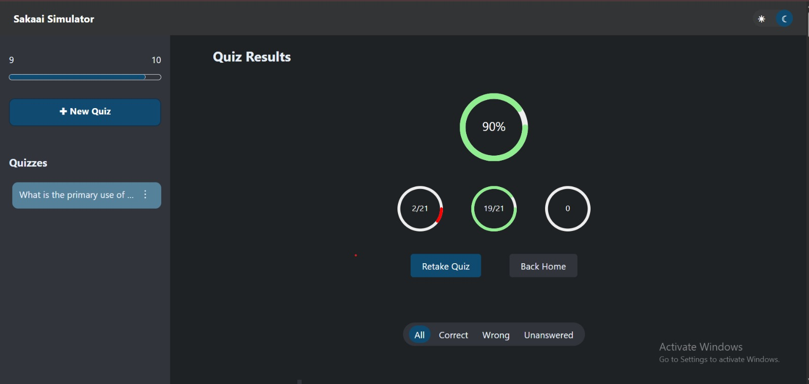                        |
| 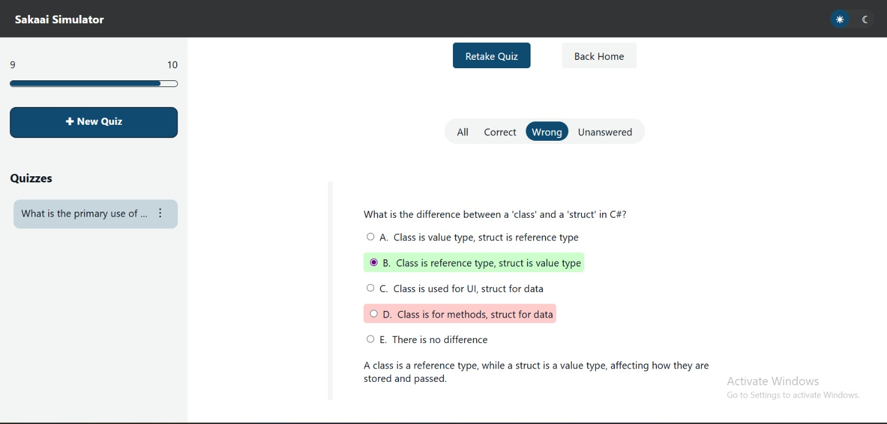 | 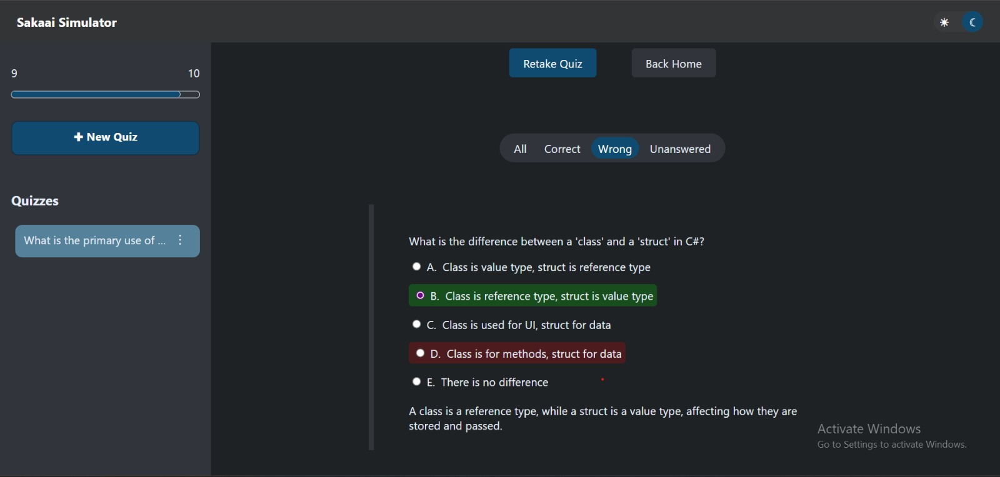 |

**Sakaai Simulator** lets you:

- **Generate** custom quizzes from any topic or text prompt
- **Take** the quiz with a clean, distraction-free interface
- **View** instant feedback (score, correct answers, explanations)
- **Persist** your quiz history in the sidebar
- **Toggle** between light and dark themes

---

## 🚀 Getting Started

1. **Clone** this repo

   ```bash
   git clone https://github.com/Programming-Sai/Sakaai-Simulator.git
   cd Sakaai-Simulator
   git checkout sakaai
   ```

2. **Install** dependencies

   ```bash
   npm install
   ```

3. **Run** the dev server

   ```bash
   npm run dev
   ```

   Open [http://localhost:3000](http://localhost:3000) in your browser.

---

## 🔧 What’s Done So Far

- **Backend**:

  - FastAPI health check, quiz-generation, evaluation, and feedback endpoints
  - Deployed on Render’s free tier (auto-wake polling)

- **Frontend**:

  - **Scaffolded** a Next.js App Router project (JS + CSS)

- **CI/CD & Previews**:

  - Vercel auto-deploys on every push to the `sakaai` branch
  - SnapMock workflow captures device-mockup screenshots and pushes to the `snapshots` branch

---

## 📬 Feedback & Contributions

Feedback is power—feel free to open issues or submit PRs. Happy quizzing! 🎉
